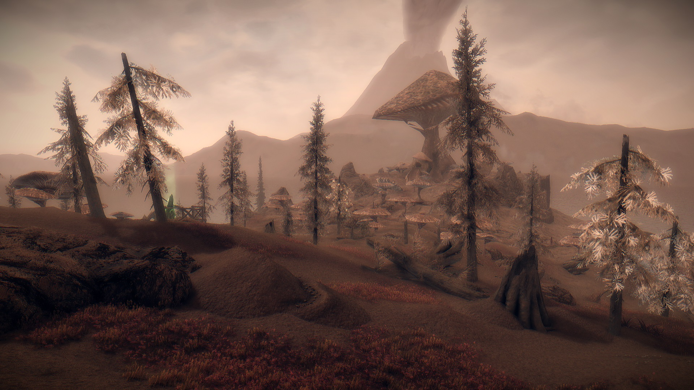

# AshLand

Result:

Inspiration:

**Description**: Inspired by the ashey island of Solstheim set in the famous video game, Skyrim, I tried my best to recreate a generative world of brownish and little vetegations barely surviving being covered in ash. "Lava" is also present to add the appearance of scorch.

**Codes**: You can change the world using the `reseed` button or by editing the map editor. The `L` represents "lava", and the `_` (underscore symbol) represents the ashy land with few vegetations.

**Life**: Black particle animation "falling from the sky" which represents the constant ash rain... fitting for a world called the Ash Land.
